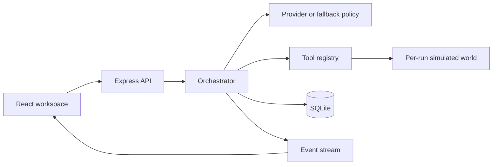

# AURA

Autonomous Unified Response Agent. An incident-response agent for the "Agentic AI & Intelligent Systems" theme.

On-call teams lose minutes jumping between logs, metrics, databases, and dashboards. AURA takes the first look itself. It plans, calls tools, explains the evidence, and stops before any impactful change. A person approves or rejects that change. AURA then checks whether the system actually recovered.

## Why this is an agent

| | Chatbot | AURA |
| --- | --- | --- |
| Starts from | A question | A goal |
| Does | Answers | Plans, calls tools, correlates evidence, acts, verifies |
| Changes systems | No | Only after approval |
| Knows it worked | No | Compares before and after |

Flow the judges can see: **Perceive → Plan → Reason → Use tools → Act → Verify → Adapt**.

## Architecture



The orchestrator is one loop. Labels such as Log Analyst or Verification Agent are roles on events, not separate models.

Phases, enforced by the server:

1. Understand the incident and write a plan.
2. Investigate with at most eight read-only tool calls.
3. Analyze into a root cause, confidence, evidence, and one remediation.
4. Wait for approval. The decision survives a page refresh.
5. Act only if the approved tool and argument hash match.
6. Verify by reading the world again and comparing it with the snapshot taken before the change.
7. Adapt once if recovery is partial or unconfirmed. A third attempt escalates.
8. Write the report.

## Tools

| Tool | Safety | What it reads or changes |
| --- | --- | --- |
| get_service_metrics | read | RPS, error rate, p95, CPU, memory |
| check_api_health | read | HEALTHY, DEGRADED, or DOWN |
| analyze_logs | read | Event count, top errors, timeline |
| analyze_transactions | read | Payment failures by reason and method |
| check_database | read | Pool, wait queue, timeouts |
| check_queue | read | Depth, consumers, lag |
| check_security_events | read | Auth failures and key mismatch |
| get_recent_changes | read | Deploys, including decoys |
| correlate_errors | read | Pearson correlation across timelines |
| apply_remediation | write | Pool, restart, workers, rollback, provider, rate limit |
| verify_recovery | read | Before/after verdict |
| generate_report | read | Report from the database |
| delete_records | destructive | Always blocked |

Safety is enforced in the tool executor. A destructive call emits `safety_blocked` and is stored as blocked.

## Scenarios

| Incident | Cause | Fix |
| --- | --- | --- |
| Payments | DB pool exhaustion, 98/100 | Pool 100 → 200 |
| Authentication | Bad JWT signing key in the latest config | Roll back that config |
| Orders | Two queue consumers, growing lag | Scale workers 2 → 6 |
| Notifications | SendGrid rate limit, circuit open | Switch to SES |

The payment demo is deterministic: 12,482 log events, 347 errors, 18.4% failures, then 1.2% and 620ms after the fix, at about 94% confidence. **Partial recovery** makes the first fix insufficient so the agent asks a second time. See `mock-data/scenarios.md`.

Each run gets its own cloned world. Tool delays are simulated infrastructure latency. The tool body still runs.

## Stack

- React, Vite, React Router, Tailwind
- Node 20+, Express, Zod, Server-Sent Events
- SQLite. The server tries `better-sqlite3` and uses `sql.js` when the native build is missing. This machine uses sql.js.
- AI providers: Gemini, OpenAI, Anthropic, or `mock`

`AI_PROVIDER=mock` needs no API key. If a live call fails validation twice, the same fallback policy answers and the sidebar shows "fallback policy".

## Data

Tables: `users`, `incidents`, `incident_events`, `agent_runs`, `tool_executions`, `remediation_actions`, `verification_results`, `reports`.

Incident status moves `open → investigating → awaiting_approval → remediating → verifying → resolved | escalated`.

Boot seeds one operator, Alex Rivera, and a few finished incidents so overview stats are computed from rows. The file is recreated on an empty disk.

## Security

- Secrets stay in the environment. `.env.example` is the template. The client bundle has no keys.
- Zod validates bodies, queries, and params. Free text is length-limited and stripped of control characters.
- Helmet, CORS locked to `CORS_ORIGIN`, and a tighter rate limit on run endpoints.
- No `eval`, no shell. Write tools need an approved row whose argument hash matches. Destructive tools are refused.
- Production errors do not include stack traces. Logs redact key-like fields.
- Prompt text tells the model that incident text and tool output are data, not instructions.
- There is no login. One seeded operator is enough for the demo.

## Run it locally

```bash
npm install
cp .env.example .env   # Windows: copy .env.example .env
npm run dev
```

Open http://localhost:5173. The API is http://localhost:8787.

```bash
npm test
npm run smoke
npm run build
```

Smoke uses `AI_PROVIDER=mock` and fast pacing. It runs all four scenarios, auto-approves, checks the payment numbers path, checks partial recovery, and checks that `delete_records` is blocked.

## Demo

Follow `docs/DEMO_SCRIPT.md`. **Run Demo Incident** calls `POST /api/demo/run` and opens the workspace. At normal pacing the investigation is watchable inside a 3–5 minute narration. Fast pacing is for tests.

## Environment

| Variable | Purpose |
| --- | --- |
| PORT | API port, default 8787 |
| NODE_ENV | development, test, or production |
| CORS_ORIGIN | Allowed browser origin |
| AI_PROVIDER | gemini, openai, anthropic, or mock |
| AI_API_KEY | Provider key. Empty with mock |
| AI_MODEL | Optional model override |
| DEMO_PACING | fast, normal, or slow |
| AURA_DB_PATH | SQLite file path |
| VITE_API_URL | Optional absolute API URL for a split deploy |

## API

Errors are `{ "error": { "code", "message" } }`.

| Method | Path | Purpose |
| --- | --- | --- |
| GET | /api/health | Process and model status |
| GET | /api/stats | Overview numbers from the database |
| GET | /api/scenarios | Sample incidents |
| GET | /api/tools | Catalog plus usage counts |
| POST | /api/incidents | Create from text or `scenarioKey` |
| GET | /api/incidents | Filter with `status` and `severity` |
| GET | /api/incidents/:id | Incident, plan, remediation, verification |
| POST | /api/incidents/:id/run | Start the agent. 202, or 409 if busy |
| POST | /api/incidents/:id/approve | `{ remediationId }` |
| POST | /api/incidents/:id/reject | `{ remediationId, reason? }` |
| GET | /api/incidents/:id/events | SSE. `Accept: application/json` or `?after=` polls. Heartbeat every 15s |
| GET | /api/incidents/:id/report | `format=json\|md\|html` |
| GET | /api/runs | Run list |
| GET | /api/runs/:id | Executions and timeline |
| POST | /api/demo/run | Payment incident plus run |
| POST | /api/admin/reset | Delete non-seed rows |

## Deploy

Frontend: Vercel (`vercel.json`) or Netlify (`netlify.toml`). Set `VITE_API_URL` to the API origin.

Backend: Render (`render.yaml`). Set `PORT`, `CORS_ORIGIN`, `AI_PROVIDER`, `AI_API_KEY`, `AI_MODEL`, `DEMO_PACING`. SQLite on `/tmp` is re-seeded on boot. SSE responses send `Cache-Control: no-cache` and `X-Accel-Buffering: no`. Use `/api/health` as the health check.

## Screenshots

Captured from the running app in `docs/screenshots/` after the local demo.

## Later

- Sign-in with JWT, if a shared demo needs it
- A real metrics backend behind the same tool interface
- More than one concurrent incident world on a hosted disk
